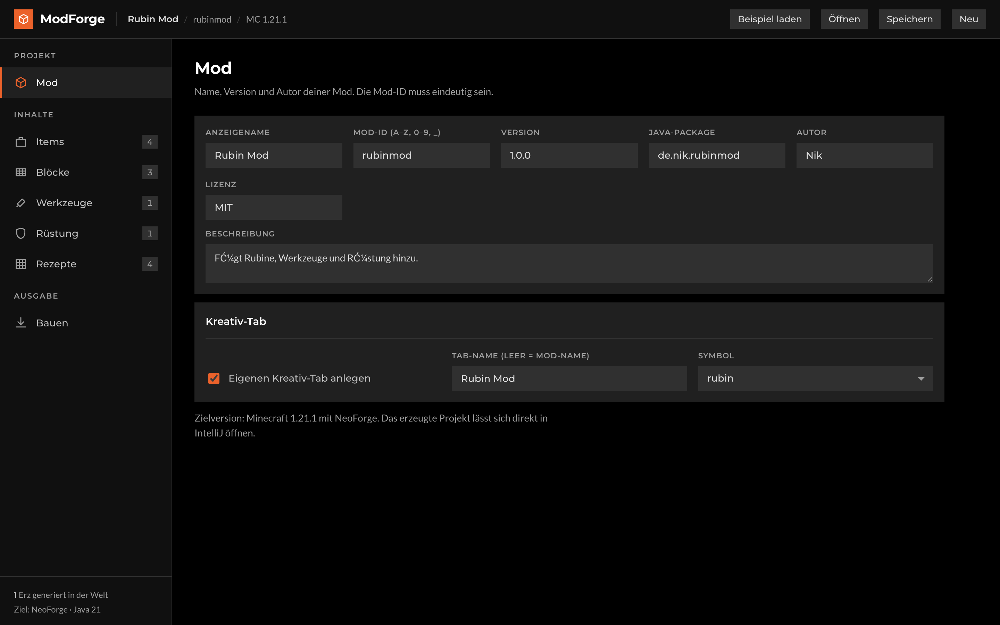
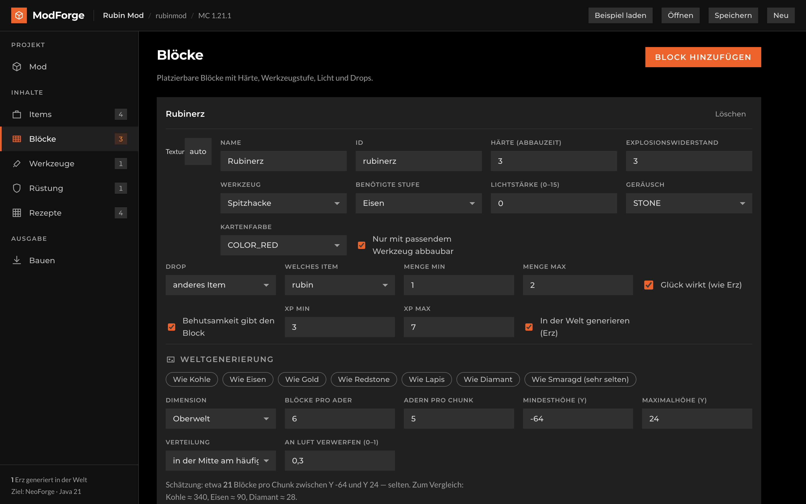
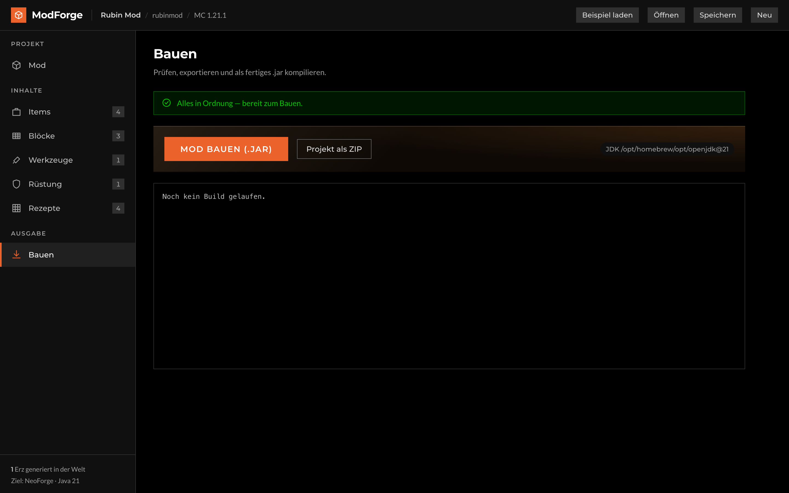

# ModForge

[Deutsch](README.de.md)

A visual editor that turns clicked-together items, blocks, tools, armour and recipes into a complete
**NeoForge mod project for Minecraft 1.21.1** — and compiles it to a finished `.jar` in one click.

No Java required. You still get a clean Gradle project if you want to keep working by hand.

> **Note on language:** the editor's interface is currently German only. Everything it *generates* —
> Java code, JSON, `en_us` language files — is English. Translating the UI is
> [a good first contribution](#contributing).



## What comes out

A single description produces, among other things:

- `build.gradle`, `settings.gradle`, `gradle.properties` and the Gradle wrapper
- Java source: main class, `ModItems`, `ModBlocks`, `ModCreativeTabs`, `ModToolTiers`,
  `ModArmorMaterials`, fuel handler
- Blockstates, item and block models
- Textures as PNG — hand-drawn or generated
- Loot tables including Fortune and Silk Touch variants, the way diamond ore does it
- Recipes (crafting table, shapeless, furnace and blast furnace); tool and armour recipes automatically
- Ore worldgen: `configured_feature`, `placed_feature` and the matching NeoForge `biome_modifier`
- Block tags (`mineable/*`, `needs_*_tool`)
- Language files `en_us` and `de_de`

## Ore that actually spawns

An ore block in the creative menu is easy. One that shows up while you're mining is not. It takes
three JSON files pointing at each other, and any typo among them produces the exact same result:
the world looks like it always did, and nothing tells you why.

ModForge writes that chain for you and offers the vanilla numbers as starting points — *like iron*,
*like diamond*, *like emerald*. Next to them sits an estimate of how many blocks per chunk you'll
actually get, compared against real ores.



## The check before the build

Minecraft loads broken mods without complaining and quietly drops whatever it didn't understand. So
ModForge checks first, and explains every finding instead of printing a line number:

- ore heights outside the dimension — above Y 127 the Nether has its bedrock ceiling
- minimum and maximum height swapped
- ore that drops nothing; blocks that need a tool but permit none
- duplicate ids, unknown ingredients, empty recipes, invalid mod ids

Errors block the build. Warnings don't.



## Getting started

```bash
npm install
npm run dev
```

Open <http://localhost:5173>. The **Beispiel laden** button fills everything with a working demo mod.

Compiling needs a **JDK 21**. ModForge looks in the usual places on its own; otherwise:

```bash
export MODFORGE_JAVA_HOME=/path/to/jdk21
```

Without a JDK the ZIP export still works.

## The editor

| Section   | Contents                                                          |
| --------- | ----------------------------------------------------------------- |
| Mod       | name, id, version, author, creative tab                           |
| Items     | stack size, rarity, tooltips, food, fuel, enchantment glint       |
| Blocks    | hardness, tool tier, light, sound, drops, XP, worldgen            |
| Tools     | one set yields pickaxe, axe, shovel, hoe and sword                |
| Armour    | helmet through boots including both worn layers                   |
| Recipes   | crafting table (3×3), shapeless and furnace                       |
| Build     | validation, ZIP export and `.jar` build with a live log           |

Textures are drawn in the built-in pixel editor (16×16, armour layers 64×32). Without your own
drawing, ModForge derives a deterministic placeholder from the id so a model is never missing.

Your work is autosaved in the browser. **Speichern** writes the description to a `.modforge.json`
file, **Öffnen** reads it back. The open section lives in the address bar, so a reload returns you
to the same place.

## Installing the mod

Drop the built `.jar` into the `mods` folder of a Minecraft installation running NeoForge for 1.21.1.

## Layout

```
src/core/      Generator — runs identically in Node and in the browser
  spec.ts        Zod schema, the single source of truth about a mod
  generator/     gradle.ts, java.ts, resources.ts
  png.ts         dependency-free PNG encoder
  textures.ts    placeholder graphics
src/server/    Fastify: validation, ZIP export, Gradle build with a log stream
src/ui/        React interface
mdk/1.21.1/    Gradle wrapper from the official MDK
test/          Vitest
```

The generator touches no browser or Node API, which is why the interface can compute the very same
preview the server later writes to disk.

## Commands

```bash
npm run dev        # server and interface together
npm test           # Vitest
npm run typecheck  # tsc --noEmit
npm run build      # build the interface for production
npm start          # server alone (also serves dist/ if present)
```

`npx tsx scripts/build-demo.ts [dir]` generates the demo mod and builds it end to end — handy for
exercising the generator without the interface. `npx tsx scripts/screenshots.ts` refreshes the
images in `docs/` (needs `npm run dev` running).

## Contributing

Bug reports and pull requests are welcome. Translating the interface to English is the most useful
thing anyone could pick up right now. Two house rules:

1. **Never write Minecraft APIs or JSON formats from memory.** They change quietly between versions,
   and wrong fields are discarded without a word at load time. Check against the real client jar and
   the extracted NeoForge sources.
2. **Every generator change needs a test** and a real run of `npx tsx scripts/build-demo.ts`. That
   TypeScript compiles says nothing about whether Minecraft likes the files.

## Licence

ModForge is [MIT licensed](LICENSE).

**What you build with it is yours.** This project claims nothing over generated mods — no attribution
requirement, no conditions on releasing or selling them, whether on CurseForge, Modrinth or privately.
The generated Java code and resources are yours to use without strings attached.

## Versions

Minecraft 1.21.1 · NeoForge 21.1.250 · ModDevGradle 2.0.147 · Java 21
